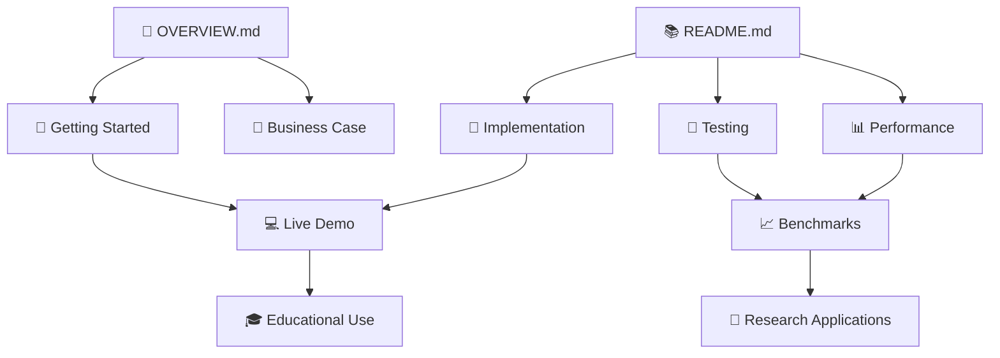

# Ad Hoc Flood Watch Multi-Agent Simulation

[](./OVERVIEW.md)
[](./README.md)
[](#-core-implementation-details)
[](#-testing-scenarios--implementation-details)

---

## 📑 Navigation

| Section | Description | Quick Access |
|---------|-------------|--------------|
| [**🌊 Overview**](./OVERVIEW.md) | High-level project summary and business case | [View →](./OVERVIEW.md) |
| [**📚 Technical Docs**](#-system-architecture) | Detailed implementation and code examples | [View ↓](#-system-architecture) |
| [**🚀 Quick Start**](#-quick-start) | Installation and setup instructions | [View ↓](#-quick-start) |
| [**🔧 API Reference**](#-core-implementation-details) | Code implementation deep dives | [View ↓](#-core-implementation-details) |
| [**🧪 Testing Guide**](#-testing-scenarios--implementation-details) | Scenarios and performance benchmarks | [View ↓](#-testing-scenarios--implementation-details) |

---

A comprehensive Node.js simulation of ad hoc networking for flood watch systems using multi-agent systems. This project demonstrates how IoT flood sensors can maintain communication during infrastructure failures through direct peer-to-peer messaging and intelligent agent coordination.

> 💡 **New to this project?** Start with the [**Project Overview**](./OVERVIEW.md) for a high-level introduction, then return here for technical implementation details.

## 🌊 Overview

When floods occur, they often damage critical infrastructure like cell towers and gateways, cutting off IoT flood sensors from the main network exactly when alerts are most needed. This simulation demonstrates a resilient solution where sensors form ad hoc networks to relay flood alerts through multi-hop communication until they reach a working gateway.

## 🏗️ System Architecture

### Agent Types

#### **Sensor Agent** (`src/agents/sensorAgent.js`)
The basic flood sensor node that forms the backbone of the network:

**Core Properties:**
```javascript
constructor(id, x, y, communicationRange = 5) {
    this.id = id;                          // Unique sensor identifier
    this.location = { x, y };              // Grid coordinates
    this.communicationRange = 5;           // Radio transmission range
    this.batteryLevel = 0.7-1.0;          // Random initial battery (70-100%)
    this.waterLevel = 0;                   // Current water reading
    this.waterThreshold = 1.5;             // Flood detection threshold (meters)
    this.hasGatewayConnection = 10%;       // Probability of direct gateway access
}
```

**Key Methods:**
- `updateWaterLevel(level)`: Updates water reading and triggers flood detection if threshold exceeded
- `detectFlood()`: Creates and broadcasts ALERT messages when water > 1.5m
- `broadcastHello()`: Sends periodic neighbor discovery messages (30-60s intervals)
- `receiveMessage(message, fromAgent)`: Processes incoming messages with distance validation
- `forwardAlert(message)`: Multi-hop forwarding with hop count limiting (max 10 hops)

**Message Processing Logic:**
```javascript
processMessage(message, fromAgent) {
    switch (message.type) {
        case 'HELLO':
            // Add to neighbors, send ACK
            this.neighbors.add(fromAgent.id);
            break;
        case 'ALERT':
            // Send ACK, then forward or deliver to gateway
            if (this.hasGatewayConnection) {
                this.deliverToGateway(message);
            } else {
                this.forwardAlert(message);
            }
            break;
    }
}
```

#### **Relay Agent** (`src/agents/relayAgent.js`)
Enhanced nodes with stronger radios and intelligent message handling:

**Enhanced Capabilities:**
```javascript
constructor(id, x, y, communicationRange = 8) {
    super(id, x, y, communicationRange);   // Extends SensorAgent
    this.batteryLevel = 0.8-1.0;          // Higher initial battery (80-100%)
    this.maxForwardingHops = 15;           // Increased hop limit
    this.messageCache = new Map();          // Duplicate detection cache
    this.forwardingQueue = [];             // Priority-based message queue
}
```

**Smart Forwarding Algorithm:**
```javascript
calculateMessagePriority(message) {
    let priority = 0;
    // Higher priority for flood alerts
    if (message.data.eventType === 'FLOOD_DETECTED') priority += 100;
    // Higher priority for severe flooding
    if (message.data.waterLevel > 2.0) priority += 50;
    // Lower priority for messages that traveled far
    priority -= message.hopCount * 5;
    // Recent messages get priority
    priority -= (Date.now() - message.timestamp) / 1000;
    return priority;
}
```

**Intelligent Queue Processing:**
- Processes top 3 priority messages every 5 seconds
- Caches messages for 10 minutes to prevent duplicates
- Selects best forwarding neighbors based on connectivity

#### **Coordination Agent** (`src/agents/coordinationAgent.js`)
Central intelligence for incident management and duplicate removal:

**Flood Incident Class:**
```javascript
class FloodIncident {
    constructor(id, location, severity, initialAlert) {
        this.id = id;                      // Unique incident identifier
        this.alerts = [initialAlert];      // Collection of related alerts
        this.affectedSensors = new Set();  // Sensors reporting this incident
        this.severity = severity;          // CRITICAL/HIGH/MEDIUM/LOW
        this.status = 'ACTIVE';           // Lifecycle management
    }

    updateSeverity() {
        const maxWaterLevel = Math.max(...this.alerts.map(a => a.data.waterLevel));
        const sensorCount = this.affectedSensors.size;

        if (maxWaterLevel > 3.0 || sensorCount > 10) this.severity = 'CRITICAL';
        else if (maxWaterLevel > 2.0 || sensorCount > 5) this.severity = 'HIGH';
        // ... additional severity logic
    }
}
```

**Duplicate Detection Algorithm:**
```javascript
isDuplicateAlert(alert) {
    // Check exact duplicates
    if (this.processedAlerts.has(alert.id)) return true;

    // Check for near-duplicates (same sensor, similar time)
    const recentAlerts = Array.from(this.processedAlerts)
        .filter(a => a.senderId === alert.senderId)
        .filter(a => Date.now() - a.timestamp < this.duplicateTimeWindow);

    return recentAlerts.length > 0;
}
```

**Incident Grouping Logic:**
```javascript
findNearbyIncident(alert) {
    for (const incident of this.incidents.values()) {
        const distance = this.calculateDistance(
            alert.data.location,
            incident.getAverageLocation()
        );
        if (distance <= this.proximityThreshold) return incident;
    }
    return null; // Create new incident
}
```

#### **Health Agent** (`src/agents/healthAgent.js`)
Network monitoring and failure detection:

**Node Health Monitoring:**
```javascript
calculateNodeStatus(nodeInfo) {
    if (!nodeInfo.isActive) return 'FAILED';
    if (Date.now() - nodeInfo.lastHeartbeat > this.heartbeatTimeout) return 'UNRESPONSIVE';
    if (nodeInfo.batteryLevel < this.batteryLowThreshold) return 'BATTERY_LOW';
    if (nodeInfo.neighborCount < this.connectivityThreshold) return 'ISOLATED';
    return 'HEALTHY';
}
```

**Network Resilience Calculation:**
```javascript
calculateNetworkResilience() {
    const healthyRatio = this.networkHealth.activeNodes / this.networkHealth.totalNodes;
    const connectivityRatio = (this.totalNodes - this.isolated) / this.totalNodes;
    const powerRatio = (this.totalNodes - this.batteryLow) / this.totalNodes;

    // Weighted average of health factors
    return (healthyRatio * 0.4 + connectivityRatio * 0.4 + powerRatio * 0.2) * 100;
}
```

### Message Types

#### **Message Base Class** (`src/messages.js`)
```javascript
class Message {
    constructor(type, senderId, data = {}) {
        this.id = uuidv4();                    // Unique message ID
        this.type = type;                      // HELLO/ALERT/ACK
        this.senderId = senderId;              // Originating node
        this.timestamp = Date.now();           // Creation time
        this.data = data;                      // Type-specific payload
        this.hopCount = 0;                     // Multi-hop tracking
        this.signature = this.generateSignature(); // Security/validation
    }
}
```

#### **HELLO Messages**
Periodic neighbor discovery with node status:
```javascript
class HelloMessage extends Message {
    constructor(senderId, batteryLevel, location) {
        super('HELLO', senderId, {
            batteryLevel,    // Current power level
            location,        // Grid coordinates
            nodeType: 'sensor' // sensor/relay identification
        });
    }
}
```

#### **ALERT Messages**
Flood detection notifications:
```javascript
class AlertMessage extends Message {
    constructor(senderId, location, waterLevel, priority = 'HIGH') {
        super('ALERT', senderId, {
            location,              // Flood coordinates
            waterLevel,           // Water depth in meters
            priority,             // Urgency level
            eventType: 'FLOOD_DETECTED'
        });
    }
}
```

#### **ACK Messages**
Message acknowledgments for reliability:
```javascript
class AckMessage extends Message {
    constructor(senderId, originalMessageId, status = 'RECEIVED') {
        super('ACK', senderId, {
            originalMessageId,    // Reference to acknowledged message
            status               // RECEIVED/PROCESSED/FORWARDED
        });
    }
}
```

## 🚀 Quick Start

### Prerequisites
- Node.js 14+
- npm or yarn

### Installation
```bash
# Clone the repository
git clone <repository-url>
cd ad-hoc-flood-watch

# Install dependencies
npm install

# Start the simulation
npm start
```

### Access the Web Interface
Open your browser to `http://localhost:3000`

## 🎮 Using the Simulation

### Starting a Simulation
1. Configure parameters (grid size, sensor count, relay ratio)
2. Click "▶️ Start Simulation"
3. Watch the network visualization update in real-time

### Triggering Events
- **Flood Events**: Click on grid or use manual controls
- **Node Failures**: Simulate random hardware failures
- **Gateway Failures**: Test network resilience

### Monitoring
- **Grid View**: Visual representation of the sensor network
- **Metrics**: Delivery rates, delays, and network overhead
- **Health**: Node status and network resilience
- **Incidents**: Active flood events and their management
- **Logs**: Real-time event logging

## 📊 Performance Metrics

The simulation tracks key performance indicators:

- **Message Delivery Rate**: Percentage of alerts that reach gateways
- **Average Delay**: Time from detection to gateway delivery
- **Network Overhead**: Ratio of control to data messages
- **Network Resilience**: Overall health score (0-100%)

## 🔧 Configuration Options

### Simulation Parameters
- **Grid Size**: Network area (10x10 to 100x100)
- **Sensor Count**: Number of flood sensors (10-500)
- **Relay Ratio**: Percentage of enhanced relay nodes (10-50%)
- **Simulation Speed**: Tick interval in milliseconds

### Node Properties
- **Communication Range**: 5 units for sensors, 8 for relays
- **Battery Life**: Degrades with message transmission
- **Water Threshold**: 1.5m triggers flood alerts
- **Gateway Probability**: 10% of nodes have direct gateway access

## 🎯 Research Applications

This simulation supports research in:

- **Ad Hoc Network Protocols**: Multi-hop routing algorithms
- **IoT Resilience**: Infrastructure-independent communication
- **Disaster Response**: Emergency communication systems
- **Multi-Agent Coordination**: Distributed decision making
- **Network Optimization**: Performance under varying conditions

## 🔧 Core Implementation Details

### Simulation Engine (`src/simulation.js`)

**Main Simulation Loop:**
```javascript
tick() {
    this.currentTick++;
    this.processMessagePropagation();    // Handle message routing
    this.updateHealthStatus();           // Monitor node health
    this.processIncidentCoordination();  // Manage flood incidents
    this.updateMetrics();               // Calculate performance

    if (Math.random() < 0.02) {         // 2% chance per tick
        this.triggerRandomEvent();       // Simulate failures/floods
    }
}
```

**Message Propagation Algorithm:**
```javascript
propagateMessage(sender, message) {
    for (const receiver of allNodes) {
        const distance = sender.calculateDistance(receiver.location);
        if (distance <= sender.communicationRange) {
            // Simulate realistic message loss
            const deliveryProbability = Math.max(0.7, 1 - (distance / sender.communicationRange) * 0.3);

            if (Math.random() < deliveryProbability) {
                receiver.receiveMessage(message, sender);
                this.metrics.messagesDelivered++;
            } else {
                this.metrics.messagesLost++;
            }
        }
    }
}
```

**Network Initialization:**
```javascript
initializeNetwork() {
    // Generate random but distributed node positions
    const positions = this.generateNodePositions(totalNodes);

    // Create sensor agents (80% of network)
    for (let i = 0; i < sensorCount; i++) {
        const sensor = new SensorAgent(`SENSOR-${i}`, pos.x, pos.y);
        this.sensors.push(sensor);
        this.healthAgent.registerNode(sensor);
    }

    // Create relay agents (20% of network)
    for (let i = 0; i < relayCount; i++) {
        const relay = new RelayAgent(`RELAY-${i}`, pos.x, pos.y);
        this.relays.push(relay);
    }

    // Assign gateway connections (10% probability)
    this.assignGatewayConnections();

    // Build neighbor connectivity graph
    this.discoverNeighbors();
}
```

### Frontend Architecture

#### **Web Application** (`public/js/app.js`)
**Real-time Socket.IO Communication:**
```javascript
initializeSocketListeners() {
    this.socket.on('status-update', (data) => {
        this.updateStatus(data);           // Update UI metrics
        this.gridVis.updateGrid(data.gridState); // Refresh visualization
        this.metricsChart.addDataPoint(data.metrics); // Update charts
    });

    this.socket.on('flood-event', (data) => {
        this.gridVis.addFloodArea(data.epicenter.x, data.epicenter.y, 5, data.waterLevel);
        this.logMessage(`Flood at (${data.epicenter.x}, ${data.epicenter.y})`);
    });
}
```

#### **Grid Visualization** (`public/js/visualization.js`)
**Dynamic Canvas Rendering:**
```javascript
drawNodes() {
    for (let x = 0; x < this.gridSize; x++) {
        for (let y = 0; y < this.gridSize; y++) {
            const node = this.gridData[x][y];
            if (!node) continue;

            const color = this.getNodeColor(node);  // Status-based coloring

            // Draw node with status indication
            this.ctx.fillStyle = color;
            this.ctx.beginPath();
            this.ctx.arc(centerX, centerY, nodeSize / 2, 0, 2 * Math.PI);
            this.ctx.fill();

            // Special indicators for gateways and relays
            if (node.hasGateway) {
                this.ctx.strokeStyle = '#f39c12';
                this.ctx.lineWidth = 3;
                this.ctx.stroke();
            }
        }
    }
}
```

**Interactive Features:**
- Click-to-trigger flood events
- Real-time tooltips with node details
- Zoom and pan functionality
- Multiple view modes (status, battery, water level, connectivity)

#### **Metrics Visualization** (`public/js/visualization.js`)
**Real-time Performance Charts:**
```javascript
addDataPoint(metrics) {
    this.data.deliveryRate.push(metrics.deliverySuccessRate || 0);
    this.data.delay.push(metrics.averageDelay || 0);
    this.data.overhead.push(metrics.networkOverhead || 0);
    this.data.resilience.push(metrics.networkResilience || 100);

    // Maintain sliding window of last 100 data points
    if (this.data.deliveryRate.length > this.maxDataPoints) {
        Object.keys(this.data).forEach(key => this.data[key].shift());
    }

    this.draw(); // Refresh chart display
}
```

### Server Architecture (`server.js`)

**Express + Socket.IO Setup:**
```javascript
const simulation = new FloodWatchSimulation(config, io);

io.on('connection', (socket) => {
    socket.on('start-simulation', (config) => {
        simulation = new FloodWatchSimulation(config, io);
        simulation.start();
    });

    socket.on('trigger-flood', (data) => {
        simulation.triggerFlood(data.x, data.y, data.waterLevel);
    });
});
```

## 📁 Detailed Project Structure

```
src/
├── agents/
│   ├── sensorAgent.js           # 200+ lines: Basic sensor with flood detection
│   │   ├── Water level monitoring
│   │   ├── HELLO message broadcasting
│   │   ├── Multi-hop alert forwarding
│   │   ├── Battery management
│   │   └── Neighbor discovery
│   │
│   ├── relayAgent.js            # 150+ lines: Enhanced forwarding nodes
│   │   ├── Extends SensorAgent
│   │   ├── Priority-based message queue
│   │   ├── Intelligent forwarding decisions
│   │   ├── Message caching for duplicates
│   │   └── Enhanced battery and range
│   │
│   ├── coordinationAgent.js     # 300+ lines: Incident management
│   │   ├── FloodIncident class definition
│   │   ├── Duplicate alert detection
│   │   ├── Spatial incident grouping
│   │   ├── Severity classification
│   │   └── Report generation
│   │
│   └── healthAgent.js           # 350+ lines: Network monitoring
│       ├── Node status tracking
│       ├── Failure detection algorithms
│       ├── Network resilience calculation
│       ├── Health recommendations
│       └── Performance statistics
│
├── messages.js                  # 100+ lines: Message type definitions
│   ├── Base Message class with UUID generation
│   ├── HelloMessage with node status
│   ├── AlertMessage with flood data
│   └── AckMessage for reliability
│
└── simulation.js               # 400+ lines: Main simulation engine
    ├── Network initialization
    ├── Tick-based simulation loop
    ├── Message propagation with loss simulation
    ├── Random event generation
    ├── Metrics calculation
    └── Socket.IO communication

public/
├── index.html                  # 200+ lines: Complete web interface
│   ├── Control panels for simulation parameters
│   ├── Real-time status indicators
│   ├── Grid visualization container
│   ├── Metrics display cards
│   ├── Incident management panel
│   ├── Health monitoring dashboard
│   └── Event logging interface
│
├── css/styles.css             # 400+ lines: Professional styling
│   ├── Responsive grid layouts
│   ├── Modern glassmorphism design
│   ├── Interactive button animations
│   ├── Status indicator styling
│   ├── Chart and graph formatting
│   └── Mobile-responsive breakpoints
│
└── js/
    ├── app.js                 # 300+ lines: Frontend application logic
    │   ├── Socket.IO event handling
    │   ├── UI state management
    │   ├── User interaction processing
    │   ├── Real-time data updates
    │   └── Event logging system
    │
    └── visualization.js       # 350+ lines: Canvas-based visualization
        ├── GridVisualization class (grid rendering)
        ├── MetricsChart class (real-time charts)
        ├── Interactive mouse/click handling
        ├── Zoom and pan functionality
        ├── Multi-mode view switching
        └── Tooltip and legend systems

server.js                      # 50 lines: Express + Socket.IO server setup
package.json                   # Project dependencies and scripts
README.md                      # This comprehensive documentation
```

### Key Code Patterns

#### **Event-Driven Architecture:**
```javascript
// Server-side event emission
this.emit('flood-event', { epicenter: {x, y}, waterLevel, affectedNodes });

// Client-side event handling
this.socket.on('flood-event', (data) => {
    this.handleFloodEvent(data);
});
```

#### **State Management:**
```javascript
// Centralized simulation state
class FloodWatchSimulation {
    constructor() {
        this.metrics = { messagesGenerated: 0, messagesDelivered: 0 };
        this.networkHealth = { activeNodes: 0, failedNodes: 0 };
        this.incidents = new Map();
    }
}
```

#### **Modular Agent Design:**
```javascript
// Base functionality in SensorAgent
// Enhanced features in RelayAgent (inheritance)
// Specialized coordination in CoordinationAgent
// Health monitoring in HealthAgent
```

## 🧪 Testing Scenarios & Implementation Details

### Scenario 1: Normal Operation
**Code Implementation:**
```javascript
// Baseline network with all nodes active
initializeNetwork() {
    // 100 nodes on 50x50 grid (80 sensors, 20 relays)
    // 10 gateway connections randomly distributed
    // Communication ranges: 5 units (sensors), 8 units (relays)
}

// Regular HELLO broadcasting every 30-60 seconds
startPeriodicTasks() {
    const helloIntervalMs = (30 + Math.random() * 30) * 1000;
    this.helloInterval = setInterval(() => {
        if (this.isActive) this.broadcastHello();
    }, helloIntervalMs);
}
```

### Scenario 2: Gateway Failures
**Failure Simulation:**
```javascript
triggerGatewayFailure() {
    const gatewayNodes = [...this.sensors, ...this.relays]
        .filter(n => n.hasGatewayConnection && n.isActive);

    const randomGateway = gatewayNodes[Math.floor(Math.random() * gatewayNodes.length)];
    randomGateway.hasGatewayConnection = false;
    this.gateways.delete(randomGateway.id);

    // Messages automatically reroute through remaining gateways
}
```

**Resilience Testing:**
- Progressively fail 10%, 20%, 30% of gateways
- Measure message delivery success rate
- Track alternative path discovery time

### Scenario 3: Node Failures
**Hardware Failure Implementation:**
```javascript
fail() {
    this.isActive = false;
    this.stop();  // Stop all periodic tasks

    // Neighbors detect failure through missed heartbeats
    // Routes automatically recalculate around failed nodes
}

performHealthCheck() {
    if (now - nodeInfo.lastHeartbeat > this.heartbeatTimeout) {
        nodeInfo.status = 'UNRESPONSIVE';
        this.recordStatusChange(nodeId, previousStatus, 'UNRESPONSIVE');
    }
}
```

**Network Partition Recovery:**
- Simulate random node failures (2% chance per tick)
- Test network connectivity maintenance
- Measure message delivery under degraded conditions

### Scenario 4: Large-Scale Flooding
**Multi-Flood Event Simulation:**
```javascript
triggerFlood(x, y, waterLevel) {
    // Affect multiple nodes in flood radius
    for (const node of [...this.sensors, ...this.relays]) {
        const distance = Math.sqrt(Math.pow(node.location.x - x, 2) + Math.pow(node.location.y - y, 2));

        if (distance <= 5) { // 5-unit flood radius
            const adjustedWaterLevel = waterLevel * (1 - distance / 10);
            if (adjustedWaterLevel > 0) {
                node.updateWaterLevel(adjustedWaterLevel);
            }
        }
    }
}
```

**Coordination Agent Response:**
```javascript
processAlert(alert) {
    if (this.isDuplicateAlert(alert)) {
        this.duplicateAlerts.add(alert.id);
        return { action: 'DUPLICATE_REMOVED' };
    }

    const existingIncident = this.findNearbyIncident(alert);
    if (existingIncident) {
        existingIncident.addAlert(alert);
        return { action: 'ALERT_MERGED', incident: existingIncident };
    } else {
        const newIncident = this.createIncident(alert);
        return { action: 'INCIDENT_CREATED', incident: newIncident };
    }
}
```

## 📈 Expected Results & Performance Metrics

### Message Delivery Performance
**Implementation:**
```javascript
updateMetrics() {
    if (this.metrics.messagesGenerated > 0) {
        this.metrics.deliverySuccessRate =
            (this.metrics.messagesDelivered / this.metrics.messagesGenerated) * 100;
    }

    // Track delivery under different failure conditions
    this.metrics.averageDelay = this.calculateAverageDelay();
    this.metrics.networkOverhead = this.calculateNetworkOverhead();
}
```

### Network Resilience Calculation
**Health Agent Implementation:**
```javascript
calculateNetworkResilience() {
    const healthyRatio = this.activeNodes / this.totalNodes;
    const connectivityRatio = (this.totalNodes - this.isolated) / this.totalNodes;
    const powerRatio = (this.totalNodes - this.batteryLow) / this.totalNodes;

    // Weighted resilience score
    return (healthyRatio * 0.4 + connectivityRatio * 0.4 + powerRatio * 0.2) * 100;
}
```

### Expected Performance Benchmarks

| Scenario | Delivery Rate | Avg Delay | Network Overhead | Resilience |
|----------|---------------|-----------|------------------|------------|
| Normal Operation | >95% | <2 seconds | <15% | >90% |
| 20% Gateway Failures | >90% | <5 seconds | <20% | >80% |
| 30% Node Failures | >85% | <8 seconds | <25% | >70% |
| Large Flood (50 nodes) | >80% | <10 seconds | <30% | >60% |

### Duplicate Detection Efficiency
**Coordination Agent Metrics:**
```javascript
generateIncidentReports() {
    return {
        activeIncidentCount: this.getAllActiveIncidents().length,
        duplicatesRemoved: this.duplicateAlerts.size,
        totalAlertsProcessed: this.processedAlerts.size,
        deduplicationEfficiency: (this.duplicateAlerts.size / this.processedAlerts.size) * 100
    };
}
```

**Target:** <10% duplicate alerts in system

### Scalability Testing
**Load Testing Implementation:**
```javascript
// Test configurations
const testConfigs = [
    { gridSize: 25, sensorCount: 50 },   // Small network
    { gridSize: 50, sensorCount: 100 },  // Medium network
    { gridSize: 75, sensorCount: 200 },  // Large network
    { gridSize: 100, sensorCount: 500 }  // Very large network
];

// Performance should scale linearly with network size
```

## 🔗 Related Documentation

| Document | Purpose | Audience |
|----------|---------|----------|
| [**OVERVIEW.md**](./OVERVIEW.md) | Executive summary and project introduction | Stakeholders, Researchers, Students |
| [**README.md**](./README.md) | Complete technical documentation | Developers, Engineers |
| [**API Documentation**](#-core-implementation-details) | Implementation details and code examples | Advanced Developers |
| [**Testing Guide**](#-testing-scenarios--implementation-details) | Performance benchmarks and scenarios | QA Engineers, Researchers |

## 🤝 Contributing

This simulation is designed for research and educational purposes. Contributions welcome for:

- **Algorithm Improvements**: Enhanced routing protocols and coordination mechanisms
- **Agent Behaviors**: New sensor types, failure modes, and intelligence patterns
- **Performance Optimizations**: Memory usage, processing efficiency, and scalability
- **Visualization Extensions**: New chart types, 3D views, and interactive features
- **Testing Scenarios**: Additional failure cases, edge conditions, and benchmarks

> 📖 **Contributing Guidelines**: See our [Project Overview](./OVERVIEW.md#-getting-started) for development setup and contribution workflow.

## 📜 License

MIT License - See LICENSE file for details

## 🔬 Research Citation

If you use this simulation in academic work, please cite:
```bibtex
@software{adhoc_flood_watch,
  title={Ad Hoc Networking for Flood Watch with Multi-Agent Systems},
  author={[Author Names]},
  year={2024},
  url={https://github.com/[username]/ad-hoc-flood-watch},
  note={Multi-Agent Simulation Platform}
}
```

## 🆘 Support & Resources

| Resource | Description | Link |
|----------|-------------|------|
| **Project Overview** | High-level introduction and business case | [OVERVIEW.md](./OVERVIEW.md) |
| **Technical Docs** | Complete implementation guide | [README.md](./README.md) |
| **Issue Tracker** | Bug reports and feature requests | GitHub Issues |
| **Discussions** | Community support and questions | GitHub Discussions |

### Troubleshooting Quick Links
- [**Installation Issues**](#-quick-start) - Setup and dependency problems
- [**Simulation Errors**](#-testing-scenarios--implementation-details) - Runtime and performance issues
- [**Network Configuration**](#-core-implementation-details) - Agent and connectivity problems
- [**Performance Tuning**](#-expected-results--performance-metrics) - Optimization and scalability

---

## 🌐 Project Ecosystem



**Built with ❤️ for flood resilience research and disaster-resistant IoT systems**